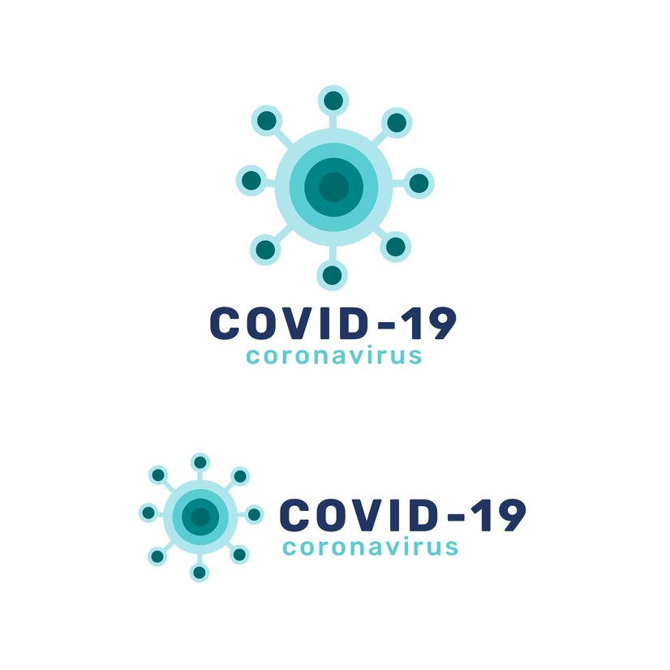

<!-- PROJECT SHIELDS -->
<!--
*** I'm using markdown "reference style" links for readability.
*** Reference links are enclosed in brackets [ ] instead of parentheses ( ).
*** See the bottom of this document for the declaration of the reference variables
*** for contributors-url, forks-url, etc. This is an optional, concise syntax you may use.
*** https://www.markdownguide.org/basic-syntax/#reference-style-links
-->
[![Stargazers][stars-shield]][stars-url]
[![Issues][issues-shield]][issues-url]
[![MIT License][license-shield]][license-url]
[![LinkedIn][linkedin-shield]][linkedin-url]

<!-- PROJECT LOGO -->
 

  

<h3 align="center">COVID-19 Contract Tracing Algorithm</h3>

  

    Using data collected from small communities, this simple Python script calculates potentially sick people, patient zeroes, and quarantine times. Easily track customers for your business and alert them if a contact trace was found, or use personally to track and trace your own interactions to best avoid the virus.
     
    <a href="https://github.com/r-oc/COVID-Contact-Tracer"><strong>Explore the docs »</strong></a>
     
     
    <a href="https://github.com/r-oc/COVID-Contact-Tracer">View Demo</a>
    ·
    <a href="https://github.com/r-oc/COVID-Contact-Tracer/issues">Report Bug</a>
    ·
    <a href="https://github.com/r-oc/COVID-Contact-Tracer/issues">Request Feature</a>
  

### Built With 
[![Python][Python]][Python-url]

(<a href="#readme-top">back to top</a>)

<!-- MARKDOWN LINKS & IMAGES -->
<!-- https://www.markdownguide.org/basic-syntax/#reference-style-links -->
[contributors-shield]: https://img.shields.io/github/contributors/r-oc/COVID-Contact-Tracer.svg?style=for-the-badge
[contributors-url]: https://github.com/r-oc/COVID-Contact-Tracer/graphs/contributors
[forks-shield]: https://img.shields.io/github/forks/r-oc/COVID-Contact-Tracer.svg?style=for-the-badge
[forks-url]: https://github.com/r-oc/COVID-Contact-Tracer/network/members
[stars-shield]: https://img.shields.io/github/stars/r-oc/COVID-Contact-Tracer.svg?style=for-the-badge
[stars-url]: https://github.com/r-oc/COVID-Contact-Tracer/stargazers
[issues-shield]: https://img.shields.io/github/issues/r-oc/COVID-Contact-Tracer.svg?style=for-the-badge
[issues-url]: https://github.com/r-oc/COVID-Contact-Tracer/issues
[license-shield]: https://img.shields.io/github/license/r-oc/COVID-Contact-Tracer.svg?style=for-the-badge
[license-url]: https://github.com/r-oc/COVID-Contact-Tracer/blob/master/LICENSE.txt
[linkedin-shield]: https://img.shields.io/badge/-LinkedIn-black.svg?style=for-the-badge&logo=linkedin&colorB=555
[linkedin-url]: https://linkedin.com/in/r-oc
[product-screenshot]: images/screenshot.png
[Next.js]: https://img.shields.io/badge/next.js-000000?style=for-the-badge&logo=nextdotjs&logoColor=white
[Next-url]: https://nextjs.org/
[React.js]: https://img.shields.io/badge/React-20232A?style=for-the-badge&logo=react&logoColor=61DAFB
[React-url]: https://reactjs.org/
[Vue.js]: https://img.shields.io/badge/Vue.js-35495E?style=for-the-badge&logo=vuedotjs&logoColor=4FC08D
[Vue-url]: https://vuejs.org/
[Angular.io]: https://img.shields.io/badge/Angular-DD0031?style=for-the-badge&logo=angular&logoColor=white
[Angular-url]: https://angular.io/
[Svelte.dev]: https://img.shields.io/badge/Svelte-4A4A55?style=for-the-badge&logo=svelte&logoColor=FF3E00
[Svelte-url]: https://svelte.dev/
[Laravel.com]: https://img.shields.io/badge/Laravel-FF2D20?style=for-the-badge&logo=laravel&logoColor=white
[Laravel-url]: https://laravel.com
[Bootstrap.com]: https://img.shields.io/badge/Bootstrap-563D7C?style=for-the-badge&logo=bootstrap&logoColor=white
[Python]: https://img.shields.io/badge/Python-ffd343?style=for-the-badge&logo=python&logoColor=black
[Python-url]: https://python.org
[Bootstrap-url]: https://getbootstrap.com
[JQuery.com]: https://img.shields.io/badge/jQuery-0769AD?style=for-the-badge&logo=jquery&logoColor=white
[JQuery-url]: https://jquery.com 
